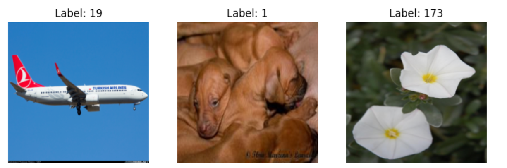

# Assignment1 CV703
This repository explores enhancing image classification by modifying the ConvNeXt architecture. We optimize performance by adapting the classifier head, integrating dropout, applying stronger data augmentations, and using a learning rate scheduler. Additionally, we replace Adam with AdamW and use SoftTargetCrossEntropy for improved training. These modifications aim to boost accuracy, reduce overfitting, and enhance model stability.

## Repository Structure

- `Flowers102_ImageClassification/`: Image classification methods on Flowers102 dataset
- `Imagewoof_ImageClassification/`: Image classification methods on Imagewoof dataset
- `combinedSet_ImageClassification/`:Image classification methods on a combined set of (Flowers102 + FGVC Aircraft + Imagewoof)
- `Jupyter Notebook/`: Assignment1 notebook
- `README.md`: Overview and setup instructions.
- `requirements.txt`: Required libraries for the Assignment.


## Architecture 
Our modified ConvNeXt architecture improves performance and generalization through several enhancements. We applied stronger data augmentations like random flips, rotations, color jitter, and MixUp to improve robustness. The classifier head was updated with Dropout for better regularization, and AdamW replaced Adam for improved optimization. We also switched to SoftTargetCrossEntropy for better soft-label training and implemented a learning rate scheduler to enhance stability and convergence. These modifications collectively boost model performance and reduce overfitting.
<p align="center">

</p>

## Dsataset 
The dataset consists of three subsets, each representing different image classification tasks. The images shown below are sample instances from each subset, along with their respective class labels.

#### Flowers102

Contains images from the Flowers102 dataset, which consists of 102 categories of flowers.
Used to evaluate the model's ability to distinguish fine-grained flower species.
<p align="center">

</p>

#### ImageWoof 

A subset of ImageNet focused on dog breeds to provide a more challenging classification problem.
Helps assess the model's ability to differentiate between similar-looking dog breeds.
<p align="center">

</p>

#### Combined Dataset 

A merged dataset containing images from Flowers102, FGVC Aircraft, and ImageWoof.
Designed to evaluate the model's generalization performance across different object types (flowers, airplanes, and dogs).
<p align="center">

</p>

## Install Requirements
Clone this repository and install the required Python packages:

```bash
git clone https://github.com/ZainabAldhanhani/Assignment1_CV703.git
cd Assignment1_CV703
pip install -r requirements.txt
```
## Train and Evaluate ConvNeXt on Flowers102 dataset
#### ConvNeXt
```bash
cd Flowers102_ImageClassification
python Flowers102_ConvNeXt.py
```
#### The proposed solution (Modified ConvNeXt)
```bash
cd Flowers102_ImageClassification
python Flowers102_ModifiedConvNeXtTiny.py
```

## Train and Evaluate ConvNeXt on Imagewoof dataset
#### ConvNeXt
```bash
cd Imagewoof_ImageClassification
python Imagewoof_ConvNeXt.py
```
#### The proposed solution (Modified ConvNeXt)
```bash
cd Imagewoof_ImageClassification
python Imagewoof_ModifiedConvNeXtTiny.py
``` 


## Train and Evaluate ConvNeXt on combined set of(Flowers102 + FGVC Aircraft + Imagewoof)
#### ConvNeXt
```bash
cd combinedSet_ImageClassification
python combinedSet _ConvNeXt.py
```
#### The proposed solution (Modified ConvNeXt)
```bash
cd Imagewoof_ImageClassification
python combinedSet _ModifiedConvNeXtTinyConvNeXtTiny.py
```
